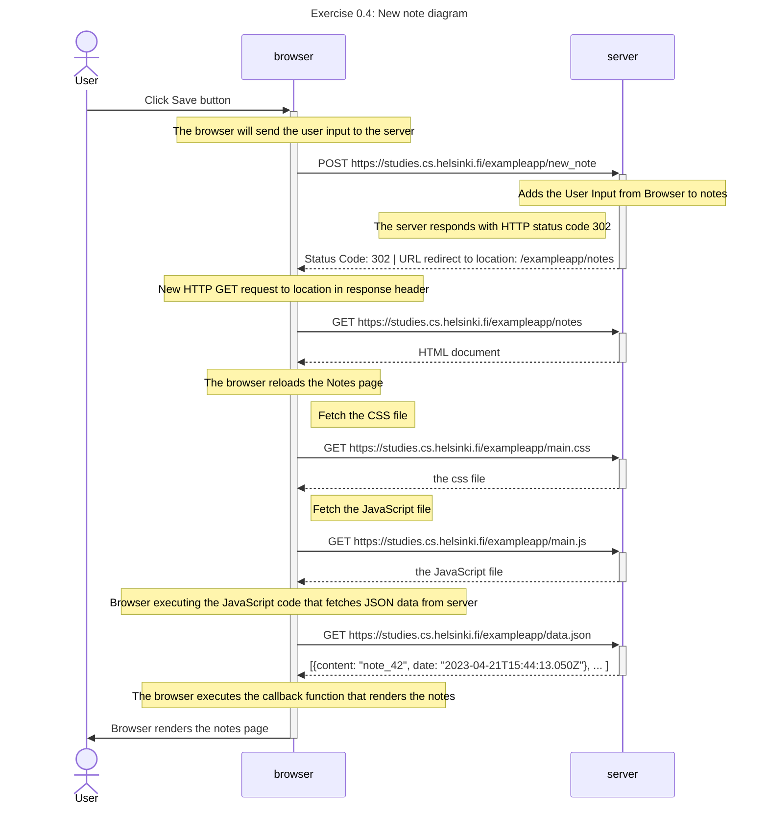

```mermaid
sequenceDiagram
    title: Exercise 0.4: New note diagram
    actor User
    participant browser
    User ->>+ browser: Click Save button

    note over browser:  The browser will send the user input to the server
    browser->>+server: POST https://studies.cs.helsinki.fi/exampleapp/new_note
    note over server: Adds the User Input from Browser to notes
    note left of server: The server responds with HTTP status code 302
    server-->>-browser: Status Code: 302 | URL redirect to location: /exampleapp/notes

    note over browser: New HTTP GET request to location in response header
    browser->>+server: GET https://studies.cs.helsinki.fi/exampleapp/notes
    server-->>-browser: HTML document

    note over browser: The browser reloads the Notes page 
    note right of browser: Fetch the CSS file
    browser->>+server: GET https://studies.cs.helsinki.fi/exampleapp/main.css
    server-->>-browser: the css file

    note right of browser: Fetch the JavaScript file
    browser->>+server: GET https://studies.cs.helsinki.fi/exampleapp/main.js
    server-->>-browser: the JavaScript file

    Note over browser: Browser executing the JavaScript code that fetches JSON data from server
    browser->>+server: GET https://studies.cs.helsinki.fi/exampleapp/data.json
    server-->>-browser: [{content: "note_42", date: "2023-04-21T15:44:13.050Z"}, ... ]

    Note over browser: The browser executes the callback function that renders the notes
    browser->>- User: Browser renders the notes page
```
