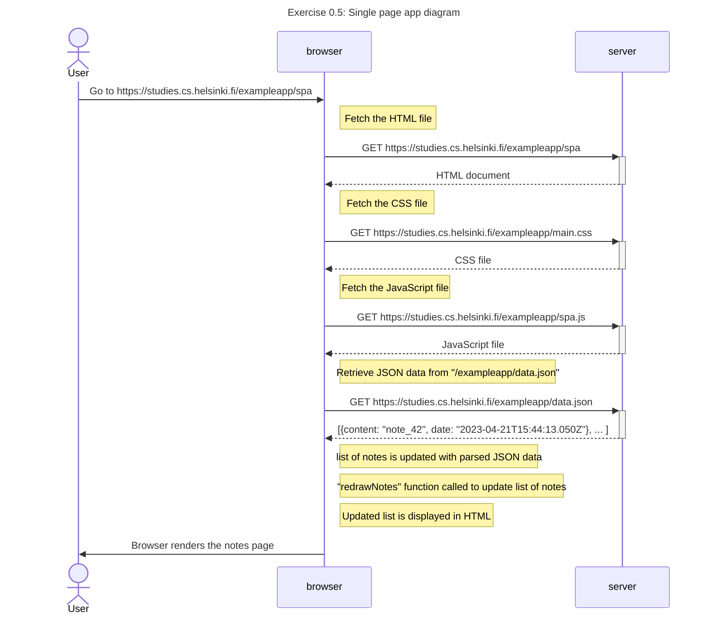

```mermaid
sequenceDiagram
    title: Exercise 0.5: Single page app diagram
    actor User
    User ->> browser: Go to https://studies.cs.helsinki.fi/exampleapp/spa

    note right of browser: Fetch the HTML file
    browser->>+server: GET https://studies.cs.helsinki.fi/exampleapp/spa
    server-->>-browser: HTML document

    note right of browser: Fetch the CSS file
    browser->>+server: GET https://studies.cs.helsinki.fi/exampleapp/main.css
    server-->>-browser: CSS file

    note right of browser: Fetch the JavaScript file
    browser->>+server: GET https://studies.cs.helsinki.fi/exampleapp/spa.js
    server-->>-browser: JavaScript file

    Note right of browser: Retrieve JSON data from "/exampleapp/data.json"
    browser->>+server: GET https://studies.cs.helsinki.fi/exampleapp/data.json
    server-->>-browser: [{content: "note_42", date: "2023-04-21T15:44:13.050Z"}, ... ]
    Note right of browser: list of notes is updated with parsed JSON data
    Note right of browser: "redrawNotes" function called to update list of notes
    Note right of browser: Updated list is displayed in HTML
    browser->> User: Browser renders the notes page
```
