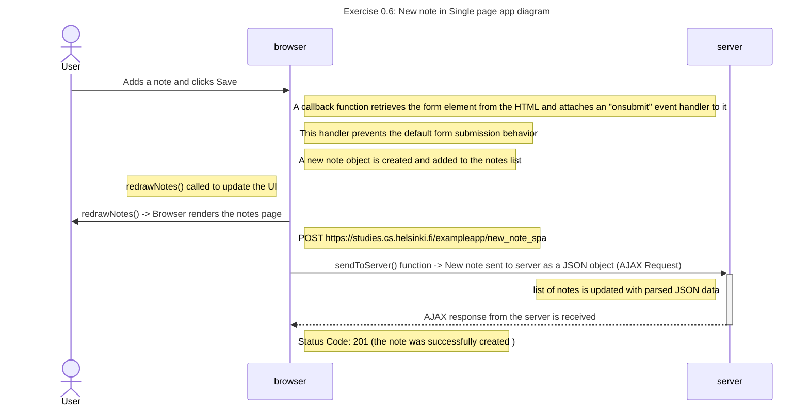

```mermaid
sequenceDiagram
    title: Exercise 0.6: New note in Single page app diagram
    actor User
    participant browser
    User ->> browser: Adds a note and clicks Save

    note right of browser: A callback function retrieves the form element from the HTML and attaches an "onsubmit" event handler to it
    note right of browser: This handler prevents the default form submission behavior
    note right of browser: A new note object is created and added to the notes list
    note left of browser: redrawNotes() called to update the UI
    browser->> User: redrawNotes() -> Browser renders the notes page

    note right of browser: POST https://studies.cs.helsinki.fi/exampleapp/new_note_spa
    browser->>+server: sendToServer() function -> New note sent to server as a JSON object (AJAX Request)
    Note left of server: list of notes is updated with parsed JSON data
    server-->>-browser: AJAX response from the server is received
    note right of browser: Status Code: 201 (the note was successfully created )
```
